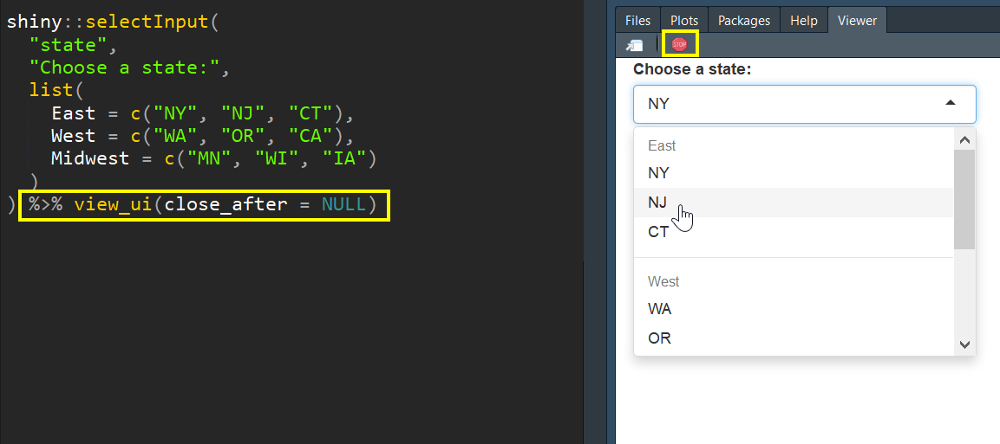

<!-- README.md is generated from README.Rmd. Please edit that file -->

```{r, include = FALSE}
knitr::opts_chunk$set(
  collapse = TRUE,
  comment = "#>",
  fig.path = "man/figures/README-",
  out.width = "100%"
)
```
# shinyobjects

<!-- badges: start -->
<!-- badges: end -->

Troubleshooting reactive data in a shiny app or flexdashboard can be difficult. The goal of this package is to access reactive objects in your local environment. This allows you to debug your code without having to actually run the app. It is my hope that this will save you time and allow you to iterate more quickly. The package converts reactive data frames into functions that will read from your raw data and become available in your global environment. The main function will also recommended that you create a dummy `input` list in your script to simulate the reactive inputs. When you run the main function, `load_reactive_objects()`, it will pre-populate this list. You can learn more about dummy input lists in [this vignette](https://rjake.github.io/shinyobjects/articles/tips-and-tricks.html). The package also includes a function to view your UI elemnts in the viewer pane (see below).

## Installation
<!--  
  You can install the released version of `shinyobjects` from [CRAN](https://CRAN.R-project.org) with:
  
  ``` r
  install.packages("shinyobjects")
  ```

-->

You can install the development version from [GitHub](https://github.com/rjake/shinyobjects) with:

``` r
# install.packages("devtools")
devtools::install_github("rjake/shinyobjects")
```
## Usage

There is a dummy flexdashboard available when the package is installed for you to see how this works. 

```{r example, eval = FALSE}
library(shinyobjects)

# If the app is open, you can just run load_reactive_objects()
# The function will detect the app that is currently open
system.file(package = "shinyobjects", "Rmd/test_dashboard_no_inputs.Rmd") %>% 
 load_reactive_objects()
```

This will result in the following output
```{r echo=FALSE, eval=TRUE, comment=""}
print(glue::glue('Here are the inputs you have listed:

  input_name  times_used  lines  missing
1      displ           1     45     TRUE
2       year           2  48,49     TRUE


Add this code chunk to your Rmd:
```{{r input_demo, eval = FALSE}}
input <- list(
  displ = "",
  year = ""
)
', '```

WARNING: This next step will load all object assignments into your global environment.
Do you want to continue? 

1: Yes
2: No
'))
```

Hitting `1` will then update your global environment with all raw data and assignments, your dummy `input` list, and all reactive objects converted to functions. As functions, the code will keep all the data manipulation and reference your dummy `input` list. Note: **this function does not change your files**; the manipulation happens within the function.

There are additional arguments you can use to resart R or to clear the environment. The `keep` argument takes a regular expression as the pattern match. To get an exact match, use the `^` and `$` to signify the beginning and end (ex. `^your_text$`). To list objects, separate them with a `|`. as shown below.

```{r, eval = FALSE}
load_reactive_objects(
  ...,
  clear_environment = TRUE, 
  keep = "test_|^df$|raw_data" # objects to keep
)
```

The package also has a function to view UI elements in one of two ways:
```{r, eval = FALSE}
shiny::selectInput(
  "state",
  "Choose a state:",
  list(
    East = c("NY", "NJ", "CT"),
    West = c("WA", "OR", "CA"),
    Midwest = c("MN", "WI", "IA")
  )
)

# the output will automatically be used here
view_ui()
```

You can also pipe it
```{r, eval = FALSE}
shiny::selectInput(
  "state",
  "Choose a state:",
  list(
    East = c("NY", "NJ", "CT"),
    West = c("WA", "OR", "CA"),
    Midwest = c("MN", "WI", "IA")
  )
) %>% view_ui(close_after = NULL)
```

Note that `close_after` is set to `NULL` in this example. The `view_ui()` function launches an app and defualts to closing after 5 seconds. You can adjusts how long it runs or use `NULL` and stop it manually by using the stop sign.:red_circle:


