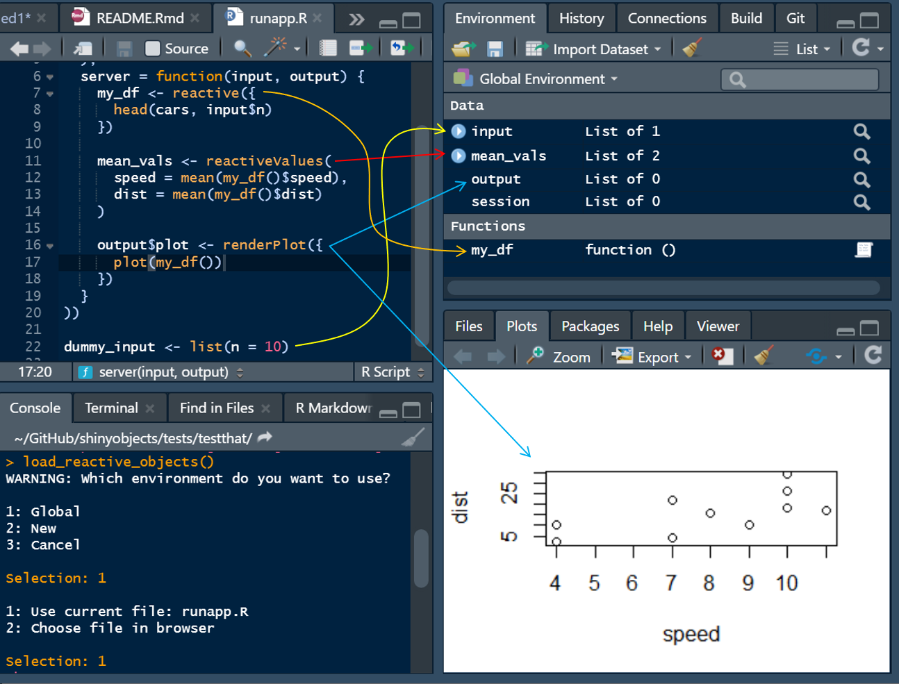
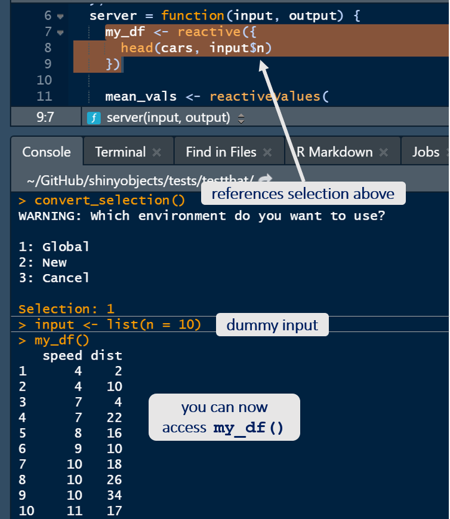
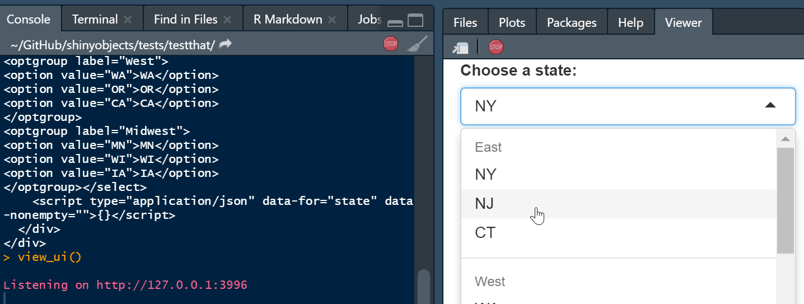
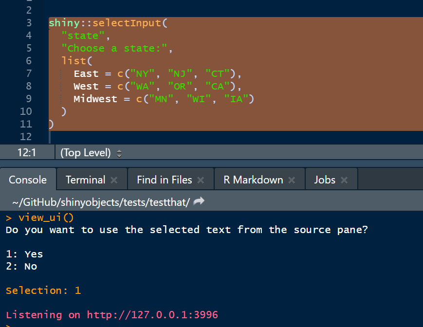

<!-- README.md is generated from README.Rmd. Please edit that file -->

```{r, include = FALSE}
knitr::opts_chunk$set(
  collapse = TRUE,
  comment = "#>",
  fig.path = "man/figures/README-",
  out.width = "100%"
)
```
# shinyobjects 
<!-- [](https://codecov.io/gh/rjake/simplecolors?branch=master)-->
<!-- badges: start -->
[](https://cran.r-project.org/package=shinyobjects)
[](https://cran.r-project.org/package=shinyobjects)
  <!-- badges: end -->
  
Troubleshooting reactive data in a `shiny` app or `flexdashboard` can be difficult. The goal of this package is to access reactive objects in your local environment. This allows you to debug your code without having to run the app. It is my hope that this will save you time and allow you to iterate more quickly. 

### How does it work?
The package converts reactive data frames into functions that will read from your raw data and become available in your environment. The main function, `load_reactive_objects()`, will recommended that you create a dummy `input` list in your script to simulate reactive inputs. When you run `load_reactive_objects()`, it will prepopulate this list. You can learn more about dummy input lists in [this vignette](https://rjake.github.io/shinyobjects/articles/tips-and-tricks.html). The package also includes a function to view your UI elements in the viewer pane (see below).

## Installation
You can install the released version of `shinyobjects` from [CRAN](https://cran.r-project.org/package=shinyobjects) with:

``` r
install.packages("shinyobjects")
```

You can install the development version from [GitHub](https://github.com/rjake/shinyobjects) with:

``` r
devtools::install_github("rjake/shinyobjects")
```
## Usage
The main function of `shinyobjects` is `load_reactive_objects()`. It is similar to running `source()` but with a lot of helpers to give you access to the reactive data. When you run it, your environment will have all your libraries, raw data and assignments, dummy `input`, `output` and `session` lists, and all `reactive()` assignments will be converted to functions. In the dev version (for 0.2.0), you also get access to your `render...()` objects in the dummy `output` list. With the dummy `input` list and the conversion of `reactive(x)` to `function() x`, the code will run your data manipulation referencing your dummy `input` list and it will be like writing a normal script. Note: **shinyobjects does not change your files**; the manipulation happens behind the scenes.



```{r example, eval = FALSE}
library(shinyobjects)

# If the app is open, the function will ask to use 
# the script currently active in the source pane
load_reactive_objects()
```

This will result in something like the following message
```
Here are the inputs you have listed:

  input_name  times_used  lines  missing
1      displ           1     45     TRUE
2       year           2  48,49     TRUE


# Add this code to your R file:
dummy_input <- list(
  displ = "",
  year = ""
)
```

If you are working on a `flexdashboard`, you will get a slightly different message to add a code chunk. Note this has `eval=FALSE` so it only runs when you need it for troubleshooting

    #Add this code chunk to your Rmd:
    ```{r input_demo, eval = FALSE}")
    input <- list(
      displ = "",
      year = ""
    )
    ```

It will then ask you where to put the objects when it sources the script:
```
WARNING: Which environment do you want to use? 

1: Global
2: New
3: Cancel

Selection:
```

**Be careful here** `load_reactive_objects()` will overwrite objects with the same name in your environment. 


Hit `1` or `2` to select the environment. You can also specify the environment using the `envir = ...` argument.

The last prompt will confirm the file to use by looking in the source pane for the script you are currently working on.

```
1: Use current file: runapp.R
2: Choose file in browser

Selection: 
```


There are additional arguments you can use to restart R or to clear the environment. The `keep` argument takes a regular expression as the pattern match. To get an exact match, use the `^` and `$` to signify the beginning and end (ex. `^your_text$`). To list objects, separate them with a `|`. as shown below.

```{r, eval = FALSE}
load_reactive_objects(
  ...,
  restart = TRUE,
  clear_environment = TRUE, 
  keep = "test_|^df$|raw_data" # objects to keep
)
```


If you made a small change to your reactive code, you can highlight the code in your source pane and run `convert_selection()` in the console.



The package also has a function to view UI elements in a few ways:

You run `view_ui()` after sending the code the console. The html output will be used.



You can pipe it
```{r, eval = FALSE}
shiny::selectInput(
  "state",
  "Choose a state:",
  list(
    East = c("NY", "NJ", "CT"),
    West = c("WA", "OR", "CA"),
    Midwest = c("MN", "WI", "IA")
  )
) %>% view_ui(close_after = NULL)
```


Note that `close_after` is set to `NULL` in this example. The `view_ui()` function launches an app and defaults to closing after 5 seconds. You can adjusts how long it runs or use `NULL` and stop it manually by using the stop sign.:red_circle: 

You can also highlight the code you want to view similar to `convert_selection()`.


